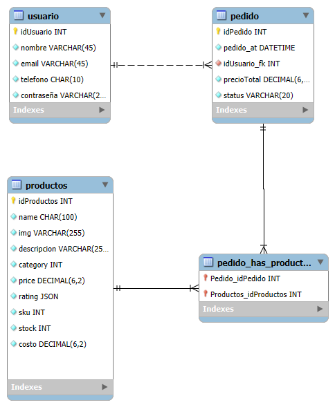

# Lootbox-Backend

## Backend_Equipo 6_Lootbox

```
Se crea el diagrama de la entidad de la base de datos del proyecto "LootBox" utilizando el workbench MySQL.
Se ejecutan los scripts para crear la base de datos del proyecto.
Se crean los scripts SQL para insertar datos de muestra para cada tabla
 (5 entradas por tabla) 
 ```
## Herramientas:
- MySQLLinks to an external site.
* MySQL WorkbenchLinks to an external site.


# Diagrama de la base de datos:

